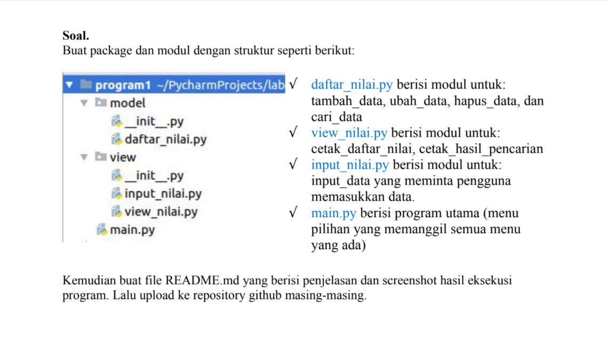

# P_16_UAS

**Struktur Package & Module**

**Penjelasan:**

**Model**

Daftar_nilai

>tambah data
        
*   data = {} untuk menampung list data yang nanti akan terinput
*   deklarasikan fungsi def tambah_data():
*   nama = input("Masukan nama: ") lalu tambahkan input nama, nim, nilai tugas, uts, uas
*   nilai_akhir = (nilai_tugas)*30/100 + (nilai_uts)*35/100 + (nilai_uas)*35/100 untuk nilai akhir diambil dari perhitungan 3 komponen nilai (nilai_tugas: 30%, nilai_uts: 35%, nilai_uas: 35%) 
*   data[nama] = [nama, nim, nilai_tugas, nilai_uts, nilai_uas, nilai_akhir] kita akan masukkan data yang tadi kita input ke dalam `data[nama]'
*   lalu cetak print()

    Ubah Data

*    deklarasikan fungsi def ubah_data():

*    nama = input("Masukan nama untuk mengubah data: ") kita akan menginput data yang nanti akan di ubah

*    if nama in data.keys(): print("Mau mengubah apa?") jika 'nama' dari di dalam 'data' maka akan mengembalikan daftar menggunakan fungsi 'keys()' lalu di cetak lah 'print()'

*    sub_data = input("(Semua), (Nama), (NIM), (Tugas), (UTS), (UAS) : ") membuat menu ubah di dalam sub_data

*    if sub_data.lower() == "semua": ambil kata kunci 'semua' di dalam sub_data jika 'semua' maka input data[nama][1] = input("Ubah NIM:") data[nama][2] = int(input("Ubah Nilai Tugas: ")) data[nama][3] = int(input("Ubah Nilai UTS: ")) data[nama][4] = int(input("Ubah Nilai UAS: "))

*    data[nama][5] = data[nama][2] *30/100 + data[nama][3]*35/100 + data[nama][4] *35/100 kita dapatkan nilai akhir dengan diambil dari perhitungan 3 komponen nilai (tugas: 30%, uts: 35%, uas: 35%), ket: [5] = nilai_akhir, dimana [0] = nama

*    lalu cetak print("\nBerhasil ubah data!")

*    Jika kita ingin mengubah data tertentu maka elif sub_data.lower() == "nim": data[nama][1] = input("NIM:") dan berlaku juga untuk nilai tugas, UTS dan UAS

*    lalu cetak print("\nBerhasil ubah data!")

*    else: print("'{}' tidak ditemukan.".format(nama)) jika kita salah dalam memasukkan nama untuk mengubah data maka akan muncul 'nama tidak di temukan'

